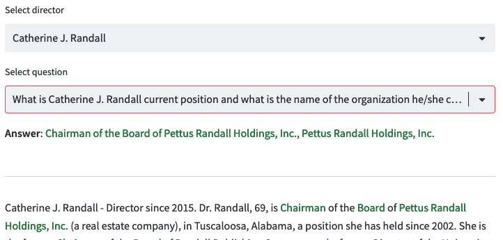

## SEC 14A QA demo
The repo demonstrates capabilities of the following tools and services:
1. Langchain
2. Streamlit
3. T5-XL
4. GPT-J Embeddings
5. Kendra
6. Openseach

## Deliverables
1. notebooks/ - a few intro-level notebooks
2. src/ - a complex Q/A demo with a choice of LLM and backend doc stores

## Prerequisites

1. Kendra - pre-install Kendra service and index 14A html files.
2. Opensearch - pre-install the service and the demo will use it as vector store and will automatically populate with embeddings. The index will require the following settings:
- Security configuration - master user (e.g. root)
- Access Policy - configure domain level access policy - json, e.g. Action: "es:*"
- In opensearch dashboard, all_access, mapped users, map the root to its backend role.

* Install the python 3.10 conda env
```
conda create --name demo -c conda-forge python=3.10
conda activate demo

pip install --upgrade pip
pip install --no-cache-dir -r requirements.txt
sh demo14a/setup.sh
```

4. Run through notebook: notebooks/01-deploy-text2text-model.ipynb and add the endpoint name in config.yaml under llm and t5_endpoint and notebooks/02-deploy-text2emb-model to get the embedding model and add it in config.yaml under llm and embedding_endpoint. 

## Run
* Run the Streamlit application 
```
sh streamlit/run.sh
```

* Open your web browser and go to the URL provided by Streamlit, usually  
https://d-mob6f1qyltor.studio.us-east-1.sagemaker.aws/jupyter/default/proxy/8501/

## Demo preview

Select LLM and document store


Ask questions
